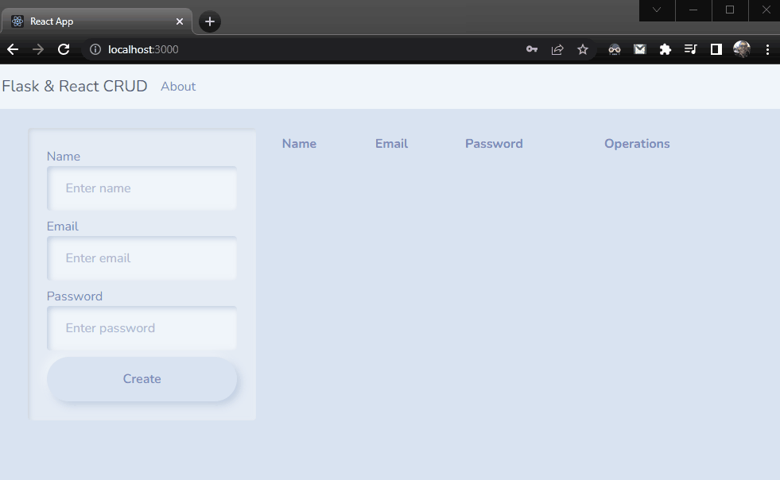

# Python Crud (Flask - React)

https://www.youtube.com/watch?v=D1W8H4Rkb9A

---

    

---

## Running the project

### Backend

    Create .env file inside backend/src folder and fill it with the following variables:
      MONGO_URI = "mongodb://..."

    source backend/venv/Scripts/activate

    python backend/src/app.py

    Visit http://localhost:5000/users to see the users list.

### Frontend (in a new terminal)

    Create .env file inside frontend/src folder and fill it with the following variables:
      REACT_APP_API_URL = "http://localhost..."

    cd frontend

    npm start

---

### Researched sites:

- https://getbootstrap.com/docs/5.1/utilities/position/#center-elements
- https://stackoverflow.com/questions/42388989/bootstrap-center-vertical-and-horizontal-alignment
- https://www.youtube.com/watch?v=8nm9WPptL0c CREA un SPINNER Loader 🌀 en CSS #shorts
- https://bootswatch.com/
- https://magic.reactjs.net/htmltojsx.htm
- https://getbootstrap.com/docs/4.0/components/navbar/
- https://github.com/topics/react-router-dom?l=javascript&o=desc&s=updated
- https://stackoverflow.com/questions/63124161/attempted-import-error-switch-is-not-exported-from-react-router-dom
- https://pypi.org/project/python-dotenv/
- https://stackoverflow.com/questions/739993/how-do-i-get-a-list-of-locally-installed-python-modules
- https://flask.palletsprojects.com/en/2.0.x/cli/
- https://medium.com/thedevproject/start-using-env-for-your-flask-project-and-stop-using-environment-variables-for-development-247dc12468be
